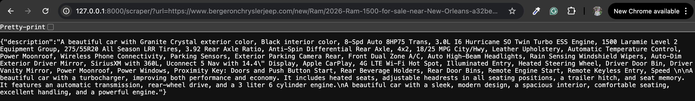

# Available features

This documents provides high overview of features currently available in this code base

## Parse car description from VDP URL

To parse car description from VDP URL, you need to provide target URL at the endpoint at `/scraper` as follows:

```
http://127.0.0.1:8000/scraper/?url=replace_this_with_your_url
```

A `JSON` object containing description will be return. For example:


