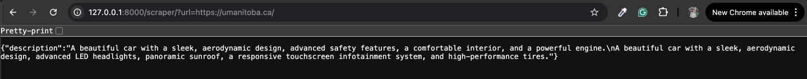

# Available features

This documents provides high overview of features currently available in this code base

## Parse car description from VDP URL

To parse car description from VDP URL, you need to provide target URL at the endpoint at `/scraper` as follows:

```
http://127.0.0.1:8000/scraper/?url=replace_this_with_your_url
```

A `JSON` object containing description will be return. For example:


### Study cases

1. Case 1

**Input:**

> https://www.bergeronchryslerjeep.com/new/Ram/2026-Ram-1500-for-sale-near-New-Orleans-a32be829ac182bc19058e5d1cb76bf57.htm

**Output**


2. Case 2

**Input:**

> https://tgb.complexdatalab.com/

**Output**


Chain of thought does help to prevent hallucinations issue.

3. Case 3

**Input:**

> https://umanitoba.ca/

**Output**



However, the improvement from chain of thought is not consistent. May be this limitation in the expressive of tiny model `gemma3:1b`?
